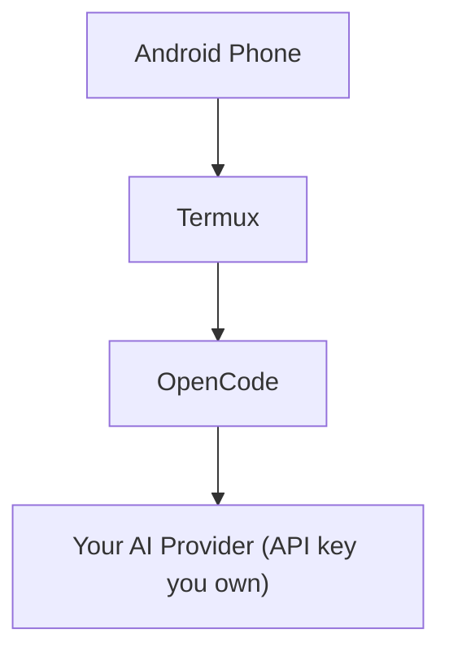

# OpenCode on Termux — Android AI Coding Setup

A complete mobile setup guide for running [OpenCode](https://opencode.ai) in Termux on Android — no desktop required.


**Guide by Infinity Codes Free**
📺 YouTube: [Infinity Code Lab Official](https://www.youtube.com/@InfinityCodeLabOfficial)
💬 Telegram: [Infinity Codes Free](https://t.me/Infinitycodesfree)

## Overview

Termux hosts Node.js and OpenCode on an Android phone, so you get a full AI coding assistant in your pocket. OpenCode can connect to any AI provider you hold a legitimate account and API key with. This repo documents that setup end to end.

> ⚠️ **Only use API keys issued directly by the provider's own dashboard.** Third-party "gateway" or "free key" channels are frequently unauthorized resellers running on compromised payment methods — routing your traffic through one exposes your prompts to an untrusted party, and the key can be revoked without warning. Get your key straight from your provider's account.

## Architecture



## Status

| Component | Status |
|---|---|
| Termux | ✅ |
| Node.js | ✅ |
| OpenCode | ✅ |
| Provider credential | ✅ |
| Provider connected | ✅ |
| Model selection | ✅ |
| AI response | ✅ |

## Features

- OpenCode running fully inside Termux
- Direct connection to your own provider account (no middleman)
- Optional custom provider definition for any OpenAI-compatible endpoint
- In-app model selection via `/models`
- AI coding/chat from an Android phone
- No companion Android app required

## Table of Contents

- [Prerequisites](#prerequisites)
- [Quick Start](#quick-start)
- [Installation](#installation)
- [Configuration](#configuration)
- [Verifying the Setup](#verifying-the-setup)
- [Usage](#usage)
- [Direct API Access](#direct-api-access)
- [Advanced Configuration](#advanced-configuration)
- [Troubleshooting](#troubleshooting)
- [Updating](#updating)
- [Security](#security)
- [Disclaimer](#disclaimer)
- [License](#license)

## Prerequisites

- An Android phone
- [Termux](https://termux.dev) installed
- An internet connection
- An API key from your own account with a legitimate AI provider
- OpenCode (installed below)

> ⚠️ **Never share your API key.** Don't post it on GitHub, in screenshots, in chat, or commit it to a repo. If a key is ever exposed, revoke it immediately and issue a new one.

## Quick Start

For a fresh Termux install, this is the whole setup end to end:

```bash
pkg update -y && pkg upgrade -y
pkg install nodejs git curl nano -y
npm install -g opencode-ai
opencode
```

Then inside OpenCode:

```
/connect          → pick your provider → paste your API key
/models           → pick your provider → pick a model
hi                → confirm you get a response
```

The sections below walk through each step in detail.

## Installation

### 1. Install Termux packages

```bash
pkg update -y
pkg upgrade -y
pkg install nodejs git curl nano -y
```

Verify the install:

```bash
node --version
npm --version
```

### 2. Install OpenCode

```bash
npm install -g opencode-ai
opencode --version
```

Launch it once to confirm it starts:

```bash
opencode
```

## Configuration

There are two paths, depending on your provider.

### Path A — Using a built-in provider (recommended)

Most major providers, including Anthropic directly, are supported out of the box. Inside OpenCode:

```
/connect
```

Pick your provider from the list and paste the API key from that provider's own dashboard. Then:

```
/models
```

Pick your provider and select a model from the list OpenCode shows you — this list is pulled live from your account, so you don't need to type a model ID by hand.

### Path B — Custom OpenAI-compatible provider

If you use a different legitimate provider that exposes an OpenAI-compatible endpoint, define it manually.

```bash
mkdir -p ~/.config/opencode
nano ~/.config/opencode/opencode.json
```

```json
{
  "$schema": "https://opencode.ai/config.json",
  "provider": {
    "yourprovider": {
      "npm": "@ai-sdk/openai-compatible",
      "name": "Your Provider Name",
      "options": {
        "baseURL": "https://your-provider-domain.example/v1"
      },
      "models": {
        "YOUR_MODEL_ID": {
          "name": "Display Name For This Model"
        }
      }
    }
  }
}
```

Replace every placeholder with the exact values from your provider's own documentation — don't guess at a base URL or model ID.

Save and exit nano: `Ctrl+O`, `Enter`, `Ctrl+X`.

### Restart and select the model

Exit OpenCode completely, then start it again:

```bash
opencode
```

```
/models
```

Select your model from the provider you configured.

## Verifying the Setup

### Test the connection

Type:

```
hi
```

A reply confirms OpenCode is talking to your provider. The footer of the reply shows which provider and model answered.

### Check saved authentication

```bash
opencode auth list
```

Your credential should appear listed. This only confirms a credential is saved — it never prints the actual secret.

### Inspect the configuration

```bash
cat ~/.config/opencode/opencode.json
```

Avoid putting a raw API key directly in this file unless you understand the tradeoff — the credential saved via `/connect` is the safer option.

## Usage

### Start OpenCode in a project

```bash
mkdir -p ~/projects/test-project
cd ~/projects/test-project
opencode
```

Example prompts:

- "Create a simple HTML landing page."
- "Analyze this project and find bugs."
- "Build a complete Android Java project structure."

### Useful commands

| Command | Description |
|---|---|
| `/connect` | Connect or update a provider |
| `/models` | Select a model |
| `/commands` | View available commands |
| `/agents` | View available agents |
| `/settings` | Open settings |
| `Ctrl+P` | Open the command palette |

### Recommended folder structure

```
~
├── .config/
│   └── opencode/
│       └── opencode.json
└── projects/
    ├── project-one/
    ├── project-two/
    └── project-three/
```

Open any project with:

```bash
cd ~/projects/project-one
opencode
```

## Direct API Access

If your provider is Anthropic, you can test your own key directly against the documented Messages API with `curl`:

```bash
curl https://api.anthropic.com/v1/messages \
  -H "Content-Type: application/json" \
  -H "x-api-key: YOUR_API_KEY" \
  -H "anthropic-version: 2023-06-01" \
  -d '{
    "model": "YOUR_MODEL_ID",
    "max_tokens": 256,
    "messages": [
      { "role": "user", "content": "Say hello in one sentence." }
    ]
  }'
```

Replace `YOUR_API_KEY` and `YOUR_MODEL_ID` locally — never paste a real key into a public repo or chat. For any other provider, use the request format their own docs specify.

## Advanced Configuration

### Set a default model

```json
{
  "$schema": "https://opencode.ai/config.json",
  "model": "yourprovider/YOUR_MODEL_ID"
}
```

With this set, OpenCode starts directly on that model.

### Add additional models

Add more entries under `"models"` in a custom provider block:

```json
"models": {
  "YOUR_MODEL_ID": {
    "name": "Display Name"
  },
  "ANOTHER_MODEL_ID": {
    "name": "Another Display Name"
  }
}
```

Use the exact model ID your provider gives you — don't guess at IDs. Restart OpenCode and run `/models` to confirm the new entry appears.

## Troubleshooting

### Connection or auth errors

If OpenCode can't reach your provider or rejects your key, check:

- API key validity (test it with the provider's own dashboard or a direct `curl` call)
- Base URL, if you're on a custom provider (Path B)
- Your account status / billing with the provider
- Your network connection

If OpenCode already returns responses normally and shows the right model/provider in the footer, the connection is working.

## Updating

```bash
opencode --version
npm update -g opencode-ai
opencode --version
```

After major OpenCode updates, double-check your provider config — provider syntax occasionally changes between versions.

## Security

- Never share, screenshot, or commit your API key.
- Add `opencode.json`, `.env`, and any config files with embedded secrets to `.gitignore`.
- Prefer the credential stored via `/connect` over hardcoding a key in `opencode.json`.
- Only use keys issued directly by your provider's own account dashboard — not shared or "free" keys from third parties.
- If a key is ever exposed:
  1. Open your provider's dashboard.
  2. Go to API Keys.
  3. Revoke the exposed key.
  4. Create a new one.
  5. Reconnect it with `/connect` in OpenCode.

## Disclaimer

This is an independent, personal setup guide. It isn't affiliated with, endorsed by, or sponsored by Anthropic or the OpenCode maintainers. "Claude" and related model names belong to Anthropic. Any provider's access, pricing, and terms of service are controlled solely by that provider — review them yourself before depending on this setup for anything important.

## License

Not yet licensed. If you plan to share this repo publicly, add a `LICENSE` file — MIT is a common, permissive choice for a setup guide like this.

---

Guide written and maintained by **Infinity Codes Free**.
More Android/AI setup guides: [YouTube](https://www.youtube.com/@InfinityCodeLabOfficial) · [Telegram](https://t.me/Infinitycodesfree)
