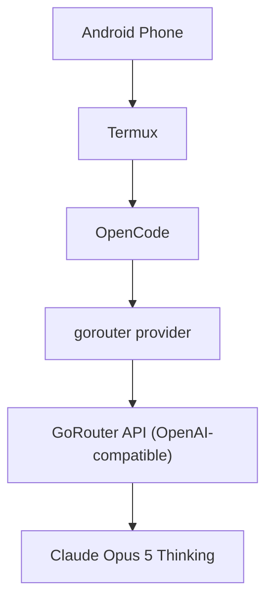

# OpenCode + GoRouter on Termux

👑 Author & Credits
Created and maintained by Infinity Codes Free
📢 Telegram: Infinity Codes Free
▶️ YouTube: Infinity Code Lab Official
This setup guide was created and maintained by Infinity Codes Free for the mobile developer community.
💬 Support
If this guide helped you, consider:
⭐ Starring this repository
📢 Joining the Telegram channel for updates
▶️ Subscribing on YouTube
📄 License
This project is licensed under the MIT License.
⚠️ Disclaimer
This guide is provided for educational purposes. Use it at your own risk. Always download tools from official or trusted sources, and keep your device's software up to date.
�
Made with ❤️ by Infinity Codes Free

A complete mobile setup guide for running [OpenCode](https://opencode.ai) in Termux on Android, using GoRouter as an OpenAI-compatible AI gateway — no desktop required.


## Overview

Termux hosts Node.js and OpenCode on an Android phone. OpenCode talks to a custom `gorouter` provider, which proxies requests through GoRouter's OpenAI-compatible API to Claude Opus 5 Thinking. This repo documents that setup end to end.

## Architecture



## Status

| Component | Status |
|---|---|
| Termux | ✅ |
| Node.js | ✅ |
| OpenCode | ✅ |
| GoRouter credential | ✅ |
| GoRouter provider | ✅ |
| OpenAI-compatible API | ✅ |
| Claude Opus 5 Thinking | ✅ |
| Model selection | ✅ |
| AI response | ✅ |

## Features

- OpenCode running fully inside Termux
- GoRouter API key authentication
- Custom `gorouter` provider definition
- Access to Claude Opus 5 Thinking
- In-app model selection via `/models`
- AI coding/chat from an Android phone
- OpenAI-compatible request/response format
- No companion Android app required

## Table of Contents

- [Prerequisites](#prerequisites)
- [Quick Start](#quick-start)
- [Installation](#installation)
- [Configuration](#configuration)
- [Verifying the Setup](#verifying-the-setup)
- [Usage](#usage)
- [Direct API Access](#direct-api-access)
- [Advanced Configuration](#advanced-configuration)
- [Troubleshooting](#troubleshooting)
- [Updating](#updating)
- [Security](#security)
- [Disclaimer](#disclaimer)
- [License](#license)

## Prerequisites

- An Android phone
- [Termux](https://termux.dev) installed
- An internet connection
- A GoRouter account and API key
- OpenCode (installed below)

> ⚠️ **Never share your API key.** Don't post it on GitHub, in screenshots, in chat, or commit it to a repo. If a key is ever exposed, revoke it immediately and issue a new one.

## Quick Start

For a fresh Termux install, this is the whole setup end to end:

```bash
pkg update -y && pkg upgrade -y
pkg install nodejs git curl nano -y
npm install -g opencode-ai
mkdir -p ~/.config/opencode
nano ~/.config/opencode/opencode.json   # paste the config from "Configuration" below
opencode
```

Then inside OpenCode:

```
/connect          → Other → gorouter → paste your API key
/models           → GoRouter → Claude Opus 5 Thinking
hi                → confirm you get a response
```

Expected footer on a successful reply: `Build · Claude Opus 5 Thinking · GoRouter`

The sections below walk through each step in detail.

## Installation

### 1. Install Termux packages

```bash
pkg update -y
pkg upgrade -y
pkg install nodejs git curl nano -y
```

Verify the install:

```bash
node --version
npm --version
```

### 2. Install OpenCode

```bash
npm install -g opencode-ai
opencode --version   # e.g. 1.15.10
```

Launch it once to confirm it starts:

```bash
opencode
```

## Configuration

### 1. Create a GoRouter API key

1. Open the GoRouter dashboard in your browser.
2. Go to **API Keys**.
3. Create a new key.
4. If GoRouter exposes model restrictions on the key, confirm it's allowed to use the model you want (leave **Model Limits** empty for unrestricted access, if your dashboard supports that).

### 2. Connect the credential in OpenCode

Start OpenCode and run:

```
/connect
```

- Choose **Other**
- Provider ID: `gorouter`
- Paste your GoRouter API key

You'll see:

```
Saved credential for gorouter.
Configure it in opencode.json to use it.
```

That's expected — `/connect` only stores the credential. The provider still needs to be defined in `opencode.json`, which is the next step.

### 3. Define the provider

Create the config directory and open the file:

```bash
mkdir -p ~/.config/opencode
nano ~/.config/opencode/opencode.json
```

```json
{
  "$schema": "https://opencode.ai/config.json",
  "provider": {
    "gorouter": {
      "npm": "@ai-sdk/openai-compatible",
      "name": "GoRouter",
      "options": {
        "baseURL": "https://gorouter.app/v1"
      },
      "models": {
        "claude-opus-5-thinking": {
          "name": "Claude Opus 5 Thinking"
        }
      }
    }
  }
}
```

Save and exit nano: `Ctrl+O`, `Enter`, `Ctrl+X`.

### 4. Restart and select the model

Exit OpenCode completely, then start it again:

```bash
opencode
```

Open the model selector:

```
/models
```

You should see:

```
GoRouter
└── Claude Opus 5 Thinking
```

Select **Claude Opus 5 Thinking**.

## Verifying the Setup

### Test the connection

Type:

```
hi
```

A successful reply looks like:

```
Hi. What are you working on?

Build · Claude Opus 5 Thinking · GoRouter
```

Seeing **GoRouter** next to the model name confirms OpenCode is routing through the GoRouter provider.

### Check saved authentication

```bash
opencode auth list
```

The credential should appear as `gorouter`. This only confirms a credential is saved — it never prints the actual secret.

### Inspect the configuration

```bash
cat ~/.config/opencode/opencode.json
```

You should see the `gorouter` provider block. Avoid putting your raw API key directly in this file unless you understand the tradeoff — the credential saved via `/connect` is the safer option.

## Usage

### Start OpenCode in a project

```bash
mkdir -p ~/projects/test-project
cd ~/projects/test-project
opencode
```

Example prompts:

- "Create a simple HTML landing page."
- "Analyze this project and find bugs."
- "Build a complete Android Java project structure."

### Useful commands

| Command | Description |
|---|---|
| `/connect` | Connect or update a provider |
| `/models` | Select a model |
| `/commands` | View available commands |
| `/agents` | View available agents |
| `/settings` | Open settings |
| `Ctrl+P` | Open the command palette |

### Recommended folder structure

```
~
├── .config/
│   └── opencode/
│       └── opencode.json
└── projects/
    ├── project-one/
    ├── project-two/
    └── project-three/
```

Open any project with:

```bash
cd ~/projects/project-one
opencode
```

## Direct API Access

GoRouter exposes an OpenAI-compatible chat completions endpoint, so you can test it directly with `curl`:

```bash
curl https://gorouter.app/v1/chat/completions \
  -H "Content-Type: application/json" \
  -H "Authorization: Bearer YOUR_API_KEY" \
  -d '{
    "model": "claude-opus-5-thinking",
    "messages": [
      { "role": "user", "content": "Say hello in one sentence." }
    ]
  }'
```

Replace `YOUR_API_KEY` locally — never paste a real key into a public repo or chat.

## Advanced Configuration

### Set a default model

```json
{
  "$schema": "https://opencode.ai/config.json",
  "model": "gorouter/claude-opus-5-thinking",
  "provider": {
    "gorouter": {
      "npm": "@ai-sdk/openai-compatible",
      "name": "GoRouter",
      "options": {
        "baseURL": "https://gorouter.app/v1"
      },
      "models": {
        "claude-opus-5-thinking": {
          "name": "Claude Opus 5 Thinking"
        }
      }
    }
  }
}
```

With this set, OpenCode starts directly on the GoRouter model.

### Add additional models

Add more entries under `"models"`:

```json
"models": {
  "claude-opus-5-thinking": {
    "name": "Claude Opus 5 Thinking"
  },
  "YOUR_OTHER_MODEL_ID": {
    "name": "Your Other Model"
  }
}
```

Use the exact model ID GoRouter provides — don't guess at IDs. Restart OpenCode and run `/models` to confirm the new entry appears.

### Model restrictions

GoRouter API keys can be scoped to specific models. If a key's **Model Limits** are set to only `claude-opus-5-thinking`, it won't be able to reach other models until you update the key's permissions in the GoRouter dashboard. After changing permissions, restart OpenCode and re-run `/models`.

## Troubleshooting

### Cloudflare 403 on a direct curl test

```bash
curl -I https://gorouter.app/v1/chat/completions
```

```
HTTP/2 403
server: cloudflare
```

This means the request was rejected before reaching the API. Before changing the model ID, check:

- API key validity
- Base URL
- GoRouter account status
- Model permissions
- Network connection

If OpenCode itself already shows `Build · Claude Opus 5 Thinking · GoRouter` and returns responses normally, the connection is working — this 403 test isn't something you need to chase further.

## Updating

```bash
opencode --version
npm update -g opencode-ai
opencode --version
```

After major OpenCode updates, double-check the provider config — provider syntax occasionally changes between versions.

## Security

- Never share, screenshot, or commit your GoRouter API key.
- Add `opencode.json`, `.env`, and any config files with embedded secrets to `.gitignore`.
- Prefer the credential stored via `/connect` over hardcoding a key in `opencode.json`.
- If a key is ever exposed:
  1. Open the GoRouter dashboard.
  2. Go to **API Keys**.
  3. Revoke the exposed key.
  4. Create a new one.
  5. Reconnect it with `/connect` in OpenCode.

## Disclaimer

This is an independent, personal setup guide. It isn't affiliated with, endorsed by, or sponsored by Anthropic, the OpenCode maintainers, or GoRouter. "Claude" and related model names belong to Anthropic. GoRouter's access to any given model, its pricing, and its terms of service are controlled solely by GoRouter — review them yourself before depending on this setup for anything important.

## License

Not yet licensed. If you plan to share this repo publicly, add a `LICENSE` file — MIT is a common, permissive choice for a setup guide like this.
